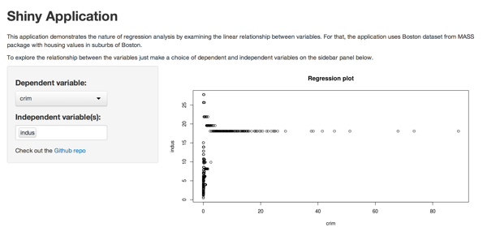

## Purpose

How easy is it to do regression analysis?

Very easy with this app!

--- .class #id 

## How it looks like



--- .class #id 

## How it works?

For demonstraion purposes the app uses the Boston dataset from MASS package. The app accepts two inputs: dependent variable and one or more independent variables. For example the code for 'nox' as dependent variable and 'age' as independend will look like:


```r
library(MASS)
depvar <- 'nox'; indepvar <- 'age'
slicedData <- Boston[, c(depvar, indepvar)]; formula <- paste(depvar, ".", sep="~")
model <- lm(formula, slicedData)
```

This will result in the model below:


```r
model$coef
```

```
## (Intercept)         age 
##    0.348204    0.003011
```

These steps can be repeated for any variables in the dataset to get the understanding of their relationship.

--- .class #id 

## Thank you

References:

* Shiny app: https://vladdy.shinyapps.io/shiny/
* This presentation: https://vladdy.github.io/devdataprod-slidify/
* Github: https://github.com/vladdy/datasciencecoursera/tree/master/devdataprod-002-project/shiny

